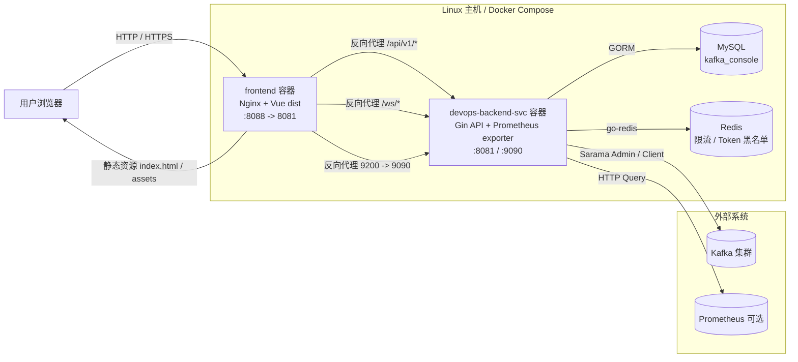
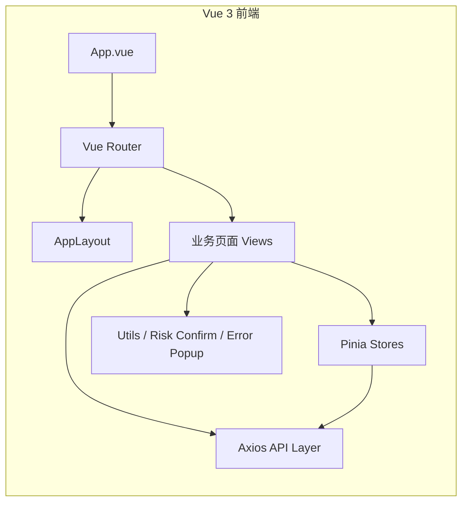
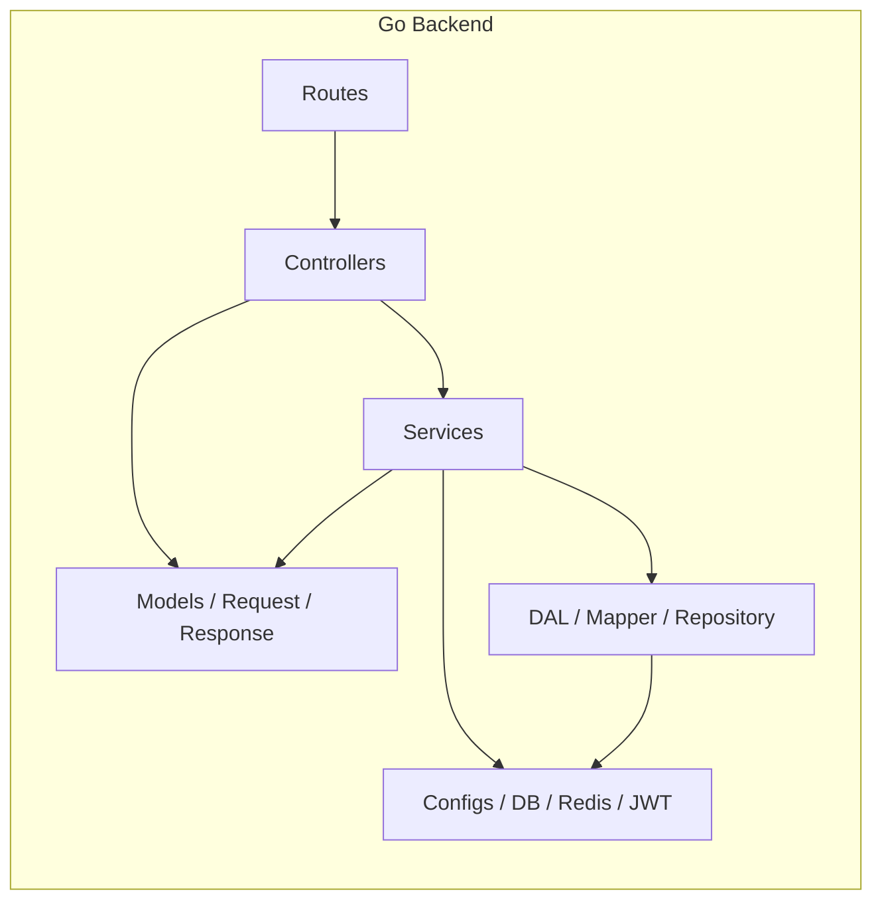
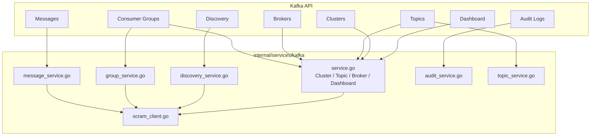
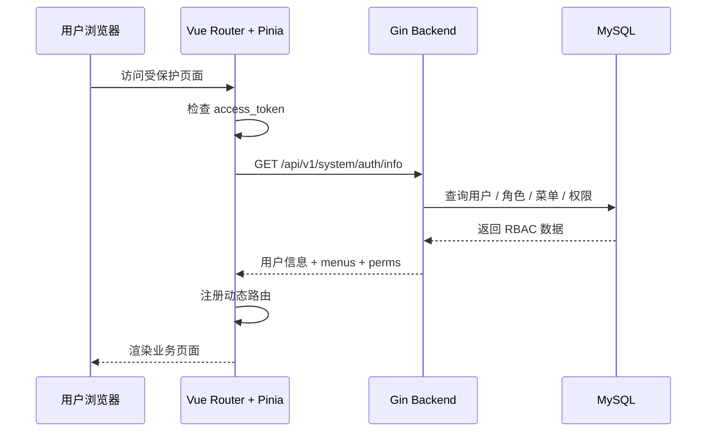
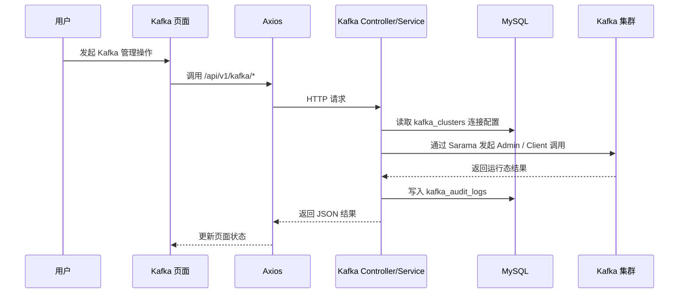
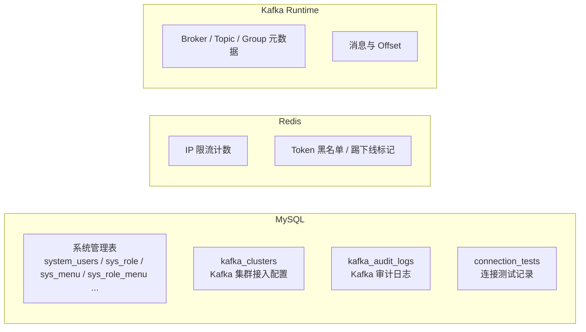

# Kafka Console 架构图

本文档基于当前源码目录整理，适用于：

- 源码模式运行：`docker-compose.yml`
- 预构建包运行：`docker-compose.prebuilt.yml`

当前项目定位为一个精简版 Kafka 运维控制台，核心能力包括：

- 集群管理
- 自动发现
- Topic 管理
- Broker 管理
- Consumer Group 管理
- 消息浏览 / 测试发送
- 审计日志

## 1. 总体运行架构



## 2. 请求入口与路由结构

```mermaid
flowchart TB
    A[浏览器请求]
    B[Nginx /api/v1 代理]
    C[Gin Engine]
    D[中间件链]
    E[/api/v1/system/*]
    F[/api/v1/kafka/*]

    A --> B --> C --> D
    D --> E
    D --> F

    subgraph MW[中间件]
        MW1[Authenticate\nJWT 认证]
        MW2[Metrics\n请求指标]
        MW3[IPRateLimit\nRedis Lua 限流]
    end

    D --> MW
```

说明：

- `/api/v1/system/*` 负责用户、角色、菜单、登录态等系统管理能力
- `/api/v1/kafka/*` 负责 Kafka 业务能力
- `/health` 和 `/metrics` 是运维检查入口

## 3. 前端架构



### 3.1 前端关键职责

- `router/index.js`
  - 处理登录态跳转
  - 在登录后动态注册菜单路由
- `stores/permissionStore.js`
  - 调用 `/system/auth/info`
  - 维护用户信息、菜单树、权限点
- `stores/kafkaStore.js`
  - 维护 Kafka 集群下拉选项
  - 维护当前选中的 `clusterId`
- `views/kafka/*`
  - 每个页面对应一个 Kafka 子域能力
- `api/*.js`
  - 统一通过 Axios 访问后端

## 4. 后端分层架构



### 4.1 层次说明

- `internal/routes`
  - 组织 Gin 路由
  - 分为 `system` 和 `kafka`
- `internal/controllers`
  - 负责参数绑定、响应封装、审计日志写入
- `internal/services`
  - 负责业务逻辑
  - Kafka 核心逻辑集中在 `internal/services/kafka`
- `internal/dal`
  - 持久化模型、请求对象、响应对象、Mapper
- `pkg/configs` / `pkg/database`
  - 负责配置加载、MySQL、Redis、Swagger、Repository 初始化

## 5. Kafka 模块内部结构



说明：

- Kafka 连接由 `Sarama Client + ClusterAdmin` 驱动
- 集群元信息保存在 MySQL `kafka_clusters`
- 运行态 Broker / Topic / Consumer Group 数据来自真实 Kafka 集群
- 操作审计落到 MySQL `kafka_audit_logs`

## 6. 关键数据流

### 6.1 登录与动态菜单



### 6.2 Kafka 操作链路



## 7. 数据存储边界



说明：

- MySQL 保存“控制台自己的配置和审计”
- Redis 保存“会话风控和限流状态”
- Kafka 保存“真实业务运行态数据”

## 8. 当前架构特点

- 前后端分离，但通过 Nginx 做统一入口与 API 代理
- 后端是典型 Gin 分层结构：`routes -> controllers -> services -> dal`
- 权限模型采用菜单 + 权限点驱动的动态路由方案
- Kafka 运行态数据不落库，按需实时查询
- 审计日志与集群接入配置持久化到 MySQL
- 预构建发布包与源码模式共享同一套运行结构

## 9. 建议阅读顺序

如果你要继续深入理解项目，建议按下面顺序读源码：

1. `docker-compose.yml`
2. `frontend/nginx.conf`
3. `backend/cmd/server/main.go`
4. `backend/internal/routes/routers.go`
5. `backend/internal/routes/kafka/kafka.go`
6. `backend/internal/services/kafka/*`
7. `frontend/src/router/index.js`
8. `frontend/src/stores/permissionStore.js`
9. `frontend/src/views/kafka/*`
