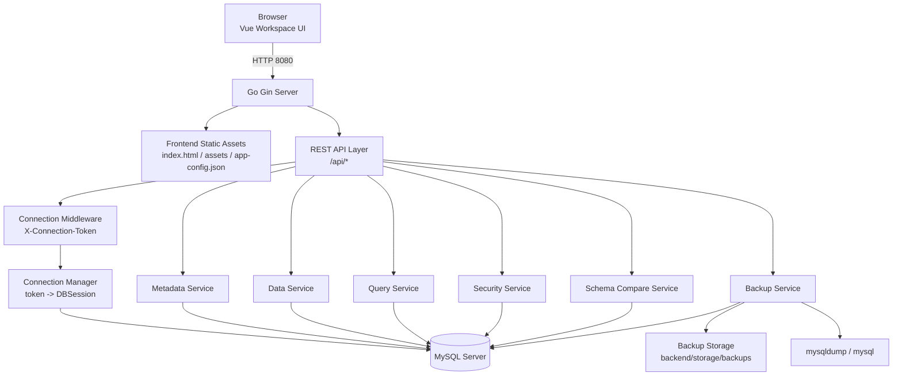

# MySQL Visual Platform

轻量化跨平台 MySQL 可视化管理

```bash
链接：https://github.com/xbh-ux/devops-console
```

## 项目目录结构图

```bash
mysql-visual-platform/
├── frontend/                          # Vue3 前端工程
│   ├── public/                        # 前端静态公共资源、运行时配置
│   ├── src/
│   │   ├── main.ts                    # 前端入口，加载运行时配置并挂载 Vue
│   │   ├── router/                    # 路由层，仅 /connect 和 /workspace
│   │   ├── stores/
│   │   │   ├── connection.ts          # 连接状态：token、连接信息
│   │   │   └── workspace.ts           # 工作上下文：当前数据库、当前数据表
│   │   ├── components/
│   │   │   ├── MainLayout.vue         # 前端 UI 中枢，壳层 + 编排层
│   │   │   └── tabs/
│   │   │       ├── TableDataTab.vue   # 数据表查看、编辑、保存
│   │   │       ├── QueryTab.vue       # SQL 查询执行页
│   │   │       ├── BackupTab.vue      # 备份与还原页
│   │   │       └── UserManagementTab.vue # 用户权限管理页
│   │   ├── utils/
│   │   │   └── request.ts             # Axios 封装：自动带 Token、自动重连、统一错误
│   │   └── ...                        # 其他样式、工具、视图组件
│   └── dist/                          # 前端打包产物，由 Go 后端统一托管
│
├── backend/                           # Go 后端工程
│   ├── main.go                        # 项目唯一入口：初始化 Gin、静态资源托管、路由注册
│   ├── router.go                      # 统一注册 /api/* 路由
│   ├── handler/                       # 薄控制器层：收参、调 service、返回响应
│   │   ├── conn_handler.go
│   │   ├── metadata_handler.go
│   │   ├── data_handler.go
│   │   ├── query_handler.go
│   │   ├── security_handler.go
│   │   ├── backup_handler.go
│   │   └── schema_handler.go
│   ├── service/                       # 业务逻辑层
│   │   ├── metadata_service.go        # 库表元数据、建库建表等
│   │   ├── data_service.go            # 表数据查询、分页、排序、筛选
│   │   ├── query_service.go           # SQL 执行、批量执行
│   │   ├── security_service.go        # 用户与权限管理
│   │   ├── backup_service.go          # 备份、还原、下载、计划任务
│   │   └── schema_compare_service.go  # 结构对比与同步
│   ├── model/
│   │   ├── session.go                 # 会话模型
│   │   └── dto.go                     # 请求/响应 DTO
│   ├── core/
│   │   ├── connection_manager.go      # 内存会话管理，token -> DBSession
│   │   └── db_pool.go                 # DB 连接池
│   └── storage/
│       └── backups/                   # 备份文件存储目录
│
├── README.md                          # 部署、运行、说明文档
└── .gitignore                         # Git 忽略规则
```


## 总体架构图



```bash
本系统采用了经典的 B/S（Browser/Server）架构，前后端分离，但部署上实现了高度的内聚。用户通过浏览器访问 Vue 构建的 Workspace UI，所有的交互请求统一通过 HTTP 协议打向后端的 Go Gin Web Server（监听 8080 端口）。

在服务端接入层，Gin Server 承担了双重职责：

静态资源托管：将打包好的前端产物（包括 index.html、assets 目录和前端所需的 app-config.json 配置文件）直接 serve 给浏览器。这种设计极大简化了系统的私有化部署成本，只需启动一个 Go 进程即可运行整个平台。

REST API 网关：所有的核心业务请求均通过 /api/* 路径前缀路由到后端 API 层。

核心亮点在于后端的“多租户/多连接”管理机制：
作为一款数据库管理工具，如何在无状态的 HTTP 请求中维持有状态的数据库连接是架构设计的关键。我们在 API 层下引入了 Connection Middleware（连接中间件）。前端每次发起 API 请求时，必须在 Header 中携带 X-Connection-Token。中间件拦截请求后，将其交给 Connection Manager（连接管理器） 解析。Connection Manager 维护了一个 Token 到真实 DBSession（MySQL 连接池）的映射字典。这保证了底层业务服务在处理请求时，总能拿到正确的、生命周期健康的数据库连接。

在业务服务层，我们根据数据库管理的领域模型，拆分出了六个核心微服务模块：

Metadata Service（元数据服务）：负责获取库、表结构、索引等元数据信息。

Data Service（数据服务）：处理表数据的增删改查。

Query Service（查询服务）：处理用户自定义的 SQL 执行与结果集分页。

Security Service（安全服务）：负责 MySQL 的用户和权限管理。

Schema Compare Service（结构比对服务）：处理不同库表之间的差异比对。

Backup Service（备份服务）：这里需要特别指出，与其他服务直接操作 MySQL Server 不同，备份服务除了连接数据库外，还向下依赖了底层的本地文件系统（backend/storage/backups）用于存储备份文件，并调用了操作系统的原生工具（如 mysqldump 和 mysql 命令）来保证大数据量导出导入的性能与可靠性。
```

## 项目说明

- 支持的功能：数据库连接、库表管理、SQL 查询、表格增删改查、智能导入导出、备份还原、结构对比、用户权限管理、中英文切换、响应式 UI
- 支持两种标准运行方式：
  1. `Windows + WSL Ubuntu`
  2. `通用 Linux`，适用于 Ubuntu、Kylin、CentOS、VMware 虚拟机内 Linux
- 项目已按轻量化方式清理：
  - 前端依赖需要在部署或开发前手动执行 `npm install`

## 环境要求

- Go `1.25+`
- Node.js `20+`
- npm `10+`
- MySQL `5.7 / 8.0`
- Linux 环境需可用 `mysql`、`mysqldump`

## 配置文件

后端配置文件：

- [backend/config/app.yaml](C:/Users/15202/project/mysql-project/mysql-visual-platform/backend/config/app.yaml)

前端运行时配置文件：

- [frontend/public/app-config.json](C:/Users/15202/project/mysql-project/mysql-visual-platform/frontend/public/app-config.json)

默认核心配置：

```yaml
server:
  address: 0.0.0.0:8080

frontend:
  dist_dir: ../frontend/dist
```

说明：

- `server.address` 控制服务监听地址
- `frontend.dist_dir` 为相对 `backend/` 的前端静态资源目录
- 前后端统一通过 `8080` 端口访问

## Linux安装部署教程

### 1. 安装部署go

```bash
# 解压 Go 安装包到系统目录 /usr/local/go
tar xf go1.25.6.linux-amd64.tar.gz -C /usr/local

# 配置环境变量
cat > /etc/profile.d/go.sh <<'EOF'
#!/bin/bash

export GOROOT=/usr/local/go
export GOPATH=$HOME/go
export PATH=$PATH:$GOROOT/bin
EOF

# 让环境变量立即生效
source /etc/profile

# 验证 Go 是否安装成功
go version
```

### 2. 安装部署node.js

```bash
# 解压
tar xf node-v20.18.0-linux-x64.tar.xz -C /usr/local

# 配置环境变量
cat > /etc/profile.d/node.sh <<'EOF'
#!/bin/bash

export NODE_HOME=/usr/local/node-v20.18.0-linux-x64
export PATH=$PATH:$NODE_HOME/bin
EOF

# 让环境变量立即生效
source /etc/profile

# 验证 node 和 npm 是否可用
node -v
npm -v
```

### 3. 编译前端

```bash
cd /path/to/mysql-visual-platform/frontend

# 安装 Vue 项目所有依赖包
npm install

# 编译前端项目，生成 dist 静态文件
npm run build:lean
```

### 4. 编译后端

```bash
cd /path/to/mysql-visual-platform/backend

# 设置国内 Go 代理，解决下载失败问题
go env -w GOPROXY=https://goproxy.cn,direct

# 关闭校验，加速编译
go env -w GOSUMDB=off

# 编译 Go 后端：纯静态编译、Linux 64位、压缩体积、输出二进制文件
CGO_ENABLED=0 GOOS=linux GOARCH=amd64 go build -trimpath -ldflags='-s -w' -o ./mysql-visual-platform ./cmd/server
```

### 5.检查配置文件

```bash
# 查看后端配置文件内容
cat /opt/mysql-visual-platform/backend/config/app.yaml

# 配置说明：
server:
  address: 0.0.0.0:8080    # 服务监听 0.0.0.0:8080，所有IP可访问

frontend:
  dist_dir: ../frontend/dist  # 前端静态资源路径
```

### 6. 后台启动

```bash
cd /path/to/mysql-visual-platform/backend

nohup ./mysql-visual-platform --config ./config/app.yaml --frontend-dist ../frontend/dist > ./server.log 2>&1 &
```

### 7. 停止服务

```bash
pkill -f '/path/to/mysql-visual-platform/backend/mysql-visual-platform'
```

### 8. 验证监听

```bash
ss -ntlp | grep 8080
LISTEN 0      4096               *:8080             *:*    users:(("mysql-visual-pl",pid=196552,fd=3))
```

### 9. 启动mysql

```bash
docker container run \
  -e MYSQL_ALLOW_EMPTY_PASSWORD="yes" \
  -d \
  --name mysql-server \
  -e MYSQL_DATABASE="ry-vue" \
  -e MYSQL_USER="linux102" \
  -e MYSQL_PASSWORD="oldboyedu" \
  --network host \
  harbor250.oldboyedu.com/oldboyedu-db/mysql:8.0.36-oracle \
  --character-set-server=utf8mb4 \
  --collation-server=utf8mb4_unicode_ci \
  --default-authentication-plugin=mysql_native_password


ss -ntl | grep 3306
LISTEN 0      70                 *:33060            *:*          
LISTEN 0      151                *:3306             *:* 
```

### 10. 访问项目

- VMware 虚拟机访问：`http://虚拟机IP:8080`